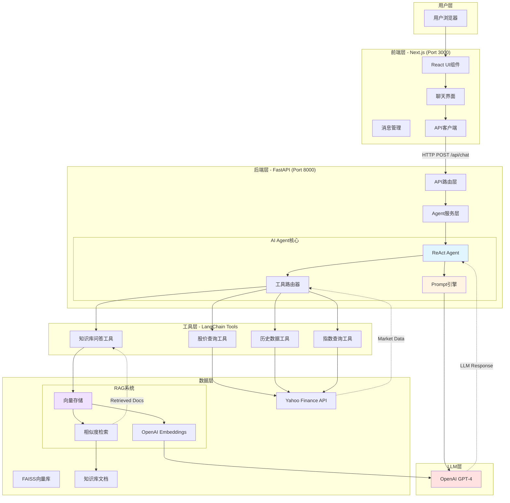
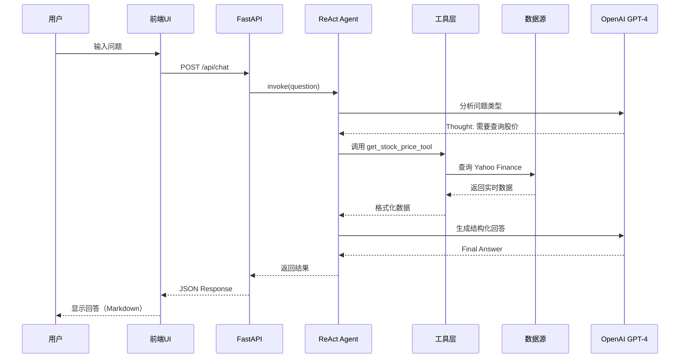
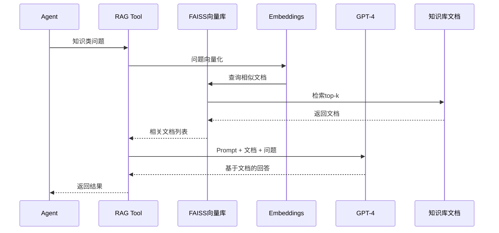

# 系统架构设计文档

## 📋 目录

- [系统概览](#系统概览)
- [架构设计](#架构设计)
- [技术选型](#技术选型)
- [数据流设计](#数据流设计)
- [关键设计决策](#关键设计决策)
- [可扩展性设计](#可扩展性设计)

---

## 系统概览

金融资产问答系统是一个基于大模型的AI-Native全栈应用，采用**分层架构**和**模块化设计**，实现了金融数据查询与知识问答的智能路由和结构化输出。

### 核心能力

- ✅ **智能路由**: 自动识别问题类型，路由到相应的数据源
- ✅ **实时数据**: 集成Yahoo Finance API获取真实市场数据
- ✅ **知识增强**: 基于RAG的金融知识库问答
- ✅ **结构化输出**: 区分客观数据与分析性描述
- ✅ **Hallucination控制**: 数据源标注与输出验证

---

## 架构设计

### 系统架构图



### 分层说明

#### 1. 用户层 (User Layer)
- **职责**: 用户交互入口
- **技术**: 现代浏览器

#### 2. 前端层 (Frontend Layer)
- **职责**: UI渲染、交互逻辑、状态管理
- **技术**: Next.js 14 + React + TypeScript + Tailwind CSS
- **特点**:
  - 组件化设计
  - TypeScript类型安全
  - 响应式UI
  - 实时消息更新

#### 3. 后端层 (Backend Layer)
- **职责**: 业务逻辑、AI编排、API服务
- **技术**: FastAPI + Python 3.12
- **特点**:
  - RESTful API设计
  - 异步处理
  - 请求验证（Pydantic）
  - 自动API文档（Swagger）

#### 4. AI Agent核心 (AI Agent Core)
- **职责**: 智能决策、工具调用、推理编排
- **技术**: LangChain + ReAct Agent
- **特点**:
  - 多步骤推理
  - 工具自动选择
  - 可解释性

#### 5. 工具层 (Tools Layer)
- **职责**: 封装外部数据源和功能
- **技术**: LangChain Custom Tools
- **特点**:
  - 统一接口抽象
  - 独立可测试
  - 易于扩展

#### 6. 数据层 (Data Layer)
- **职责**: 数据存储与检索
- **技术**: Yahoo Finance API + FAISS + TXT文档
- **特点**:
  - 实时数据源
  - 向量化存储
  - 高效检索

#### 7. LLM层 (LLM Layer)
- **职责**: 自然语言理解与生成
- **技术**: OpenAI GPT-4.1-mini
- **特点**:
  - 推理能力强
  - 上下文理解
  - 结构化输出

---

## 技术选型

### 前端技术栈

| 技术 | 版本 | 选择理由 |
|------|------|----------|
| **Next.js** | 14 | • App Router架构<br>• 服务端渲染<br>• 优秀的开发体验<br>• 内置优化 |
| **React** | 18 | • 组件化开发<br>• 生态成熟<br>• 性能优秀 |
| **TypeScript** | 5 | • 类型安全<br>• IDE支持好<br>• 减少运行时错误 |
| **Tailwind CSS** | 3.4 | • 快速开发<br>• 样式一致性<br>• 响应式友好 |
| **Axios** | 1.7 | • HTTP客户端成熟<br>• 拦截器支持<br>• 错误处理完善 |

### 后端技术栈

| 技术 | 版本 | 选择理由 |
|------|------|----------|
| **FastAPI** | 0.104+ | • 高性能（基于Starlette）<br>• 自动API文档<br>• Pydantic验证<br>• 异步支持 |
| **LangChain** | 0.1+ | • Agent框架成熟<br>• 工具集成丰富<br>• ReAct模式支持<br>• 社区活跃 |
| **FAISS** | 1.7+ | • 向量检索快速<br>• 内存占用小<br>• Facebook维护<br>• Python绑定完善 |
| **yfinance** | 0.2+ | • Yahoo Finance官方<br>• 数据准确<br>• 免费使用<br>• 支持全球市场 |

### LLM技术栈

| 技术 | 选择理由 |
|------|----------|
| **OpenAI GPT-4** | • 推理能力强<br>• 中文理解好<br>• 工具调用支持<br>• 输出质量高 |
| **text-embedding-ada-002** | • 向量质量高<br>• 成本相对低<br>• 与GPT系列兼容 |

---

## 数据流设计

### 查询流程（问答数据流）



### RAG检索流程



---

## 关键设计决策

### 1. 为什么选择 ReAct Agent？

**决策**: 使用LangChain的ReAct Agent而非简单的function calling

**理由**:
- ✅ **可解释性**: ReAct模式输出Thought过程，便于调试
- ✅ **灵活性**: 支持多步推理，可以先查数据再分析
- ✅ **扩展性**: 易于添加新工具，无需修改核心逻辑
- ✅ **鲁棒性**: 自动处理工具调用失败等异常情况

**对比**:
```python
# ❌ 简单方式：直接调用函数
if "股价" in question:
    return get_stock_price()
elif "市盈率" in question:
    return query_knowledge_base()

# ✅ ReAct Agent：智能路由
agent.invoke(question)  # 自动分析、选择工具、执行、总结
```

### 2. 为什么选择 FAISS 向量库？

**决策**: 使用FAISS而非其他向量数据库（如Chroma、Pinecone）

**理由**:
- ✅ **性能**: Facebook出品，检索速度快
- ✅ **轻量**: 无需额外服务，直接嵌入应用
- ✅ **成本**: 完全免费，无API调用限制
- ✅ **适配性**: 知识库规模小（5个文档），FAISS足够

**权衡**:
- ❌ 不支持分布式（但MVP不需要）
- ❌ 无Web界面（但有LangChain封装）

### 3. 为什么前后端分离？

**决策**: 采用Next.js前端 + FastAPI后端的分离架构

**理由**:
- ✅ **职责清晰**: 前端专注UI，后端专注业务逻辑
- ✅ **技术适配**: Python生态在AI领域更成熟
- ✅ **独立扩展**: 前后端可独立部署和扩展
- ✅ **团队协作**: 前后端开发可并行

### 4. 为什么使用 Prompt 结构化设计？

**决策**: 使用PromptTemplate而非字符串拼接

**理由**:
- ✅ **可维护**: 模板集中管理，易于版本控制
- ✅ **可测试**: 可以A/B测试不同Prompt
- ✅ **可复用**: 模板可以跨项目复用
- ✅ **控制力**: 精确控制输出格式

**示例**:
```python
# ❌ 字符串拼接
prompt = f"你是金融助手。回答：{question}"

# ✅ 结构化模板
template = PromptTemplate(
    input_variables=["context", "question"],
    template="""你是专业金融助手。

参考资料：{context}
用户问题：{question}

要求：
1. 区分客观数据和分析推测
2. 标注数据来源
3. 使用结构化输出

回答："""
)
```

---

## 可扩展性设计

### 1. 工具扩展

**新增数据源**:
```python
# 1. 定义新工具
@tool
def get_news_tool(stock_symbol: str) -> str:
    """获取股票相关新闻"""
    # 调用新闻API
    pass

# 2. 注册到Agent
tools = [
    get_stock_price_tool,
    get_news_tool,  # 新增
]
agent = build_agent(tools)
```

**无需修改**:
- ✅ Agent核心逻辑
- ✅ Prompt模板
- ✅ 前端代码

### 2. 模型替换

**切换LLM提供商**:
```python
# OpenAI
llm = ChatOpenAI(model="gpt-4")

# 替换为Claude
llm = ChatAnthropic(model="claude-3")

# 替换为本地模型
llm = Ollama(model="llama2")
```

**接口统一**: LangChain统一了不同LLM的调用接口

### 3. 向量库升级

**迁移到生产级向量库**:
```python
# FAISS (开发/MVP)
vectorstore = FAISS.from_documents(docs, embeddings)

# 升级为 Chroma (生产)
vectorstore = Chroma.from_documents(docs, embeddings)

# 升级为 Pinecone (大规模)
vectorstore = Pinecone.from_documents(docs, embeddings)
```

**无缝切换**: LangChain统一了向量库接口

### 4. 前端组件化

**新增问答类型**:
```tsx
// 1. 新增消息类型组件
<StockChartMessage data={chartData} />

// 2. 在MessageItem中判断
{message.type === 'chart' && <StockChartMessage />}
{message.type === 'text' && <TextMessage />}
```

---

## 性能考虑

### 1. 缓存策略

```python
# 问答结果缓存（避免重复计算）
@lru_cache(maxsize=100)
def cached_query(question: str) -> str:
    return agent.chat(question)

# 股价数据缓存（减少API调用）
cache = TTLCache(maxsize=1000, ttl=60)  # 60秒缓存
```

### 2. 异步处理

```python
# FastAPI天然支持异步
@app.post("/api/chat")
async def chat(request: ChatRequest):
    # 异步调用LLM
    result = await async_agent.ainvoke(request.question)
    return result
```

### 3. 流式输出（可选）

```python
# 支持SSE流式返回
@app.post("/api/chat/stream")
async def chat_stream(request: ChatRequest):
    async for chunk in agent.astream(request.question):
        yield f"data: {chunk}\n\n"
```

---

## 安全考虑

### 1. API密钥保护

```python
# ✅ 使用环境变量
OPENAI_API_KEY = os.getenv("OPENAI_API_KEY")

# ❌ 不要硬编码
# OPENAI_API_KEY = "sk-xxxxx"
```

### 2. 输入验证

```python
# Pydantic模型验证
class ChatRequest(BaseModel):
    question: str = Field(..., min_length=1, max_length=1000)
```

### 3. 错误处理

```python
try:
    result = agent.invoke(question)
except Exception as e:
    logger.error(f"Agent error: {e}")
    return {"error": "处理失败，请稍后重试"}
```

---

## 监控与日志

### 1. 结构化日志

```python
import logging

logger.info(
    "Chat request processed",
    extra={
        "question": question,
        "response_time": elapsed_time,
        "tool_calls": tool_count,
    }
)
```

### 2. 性能指标

```python
# 记录关键指标
metrics = {
    "response_time": 1.2,  # 秒
    "llm_calls": 2,
    "tool_calls": 1,
    "success": True,
}
```

---

## 总结

### 架构优势

1. **分层清晰**: 前端、后端、AI、数据各层职责明确
2. **模块化**: 每个组件独立可测试、可替换
3. **可扩展**: 易于添加新工具、新数据源、新功能
4. **可维护**: 代码结构清晰，文档完善
5. **高性能**: 异步处理、缓存优化、流式输出

### 技术亮点

1. **AI-Native设计**: 以AI为核心的架构设计
2. **LLM Harness**: 完善的Prompt工程和工具调用
3. **RAG集成**: 知识库增强生成
4. **Hallucination控制**: 数据源标注和输出验证
5. **工程规范**: 类型安全、错误处理、日志监控

---

**文档版本**: v1.0
**最后更新**: 2026-03-15
**维护者**: 万超
