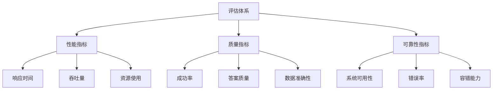
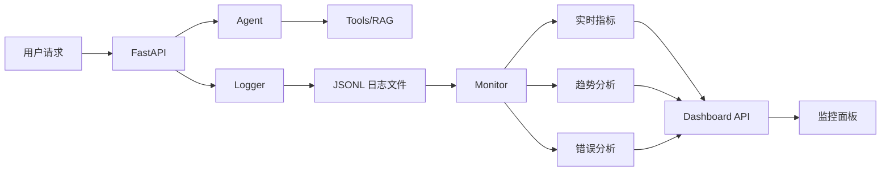
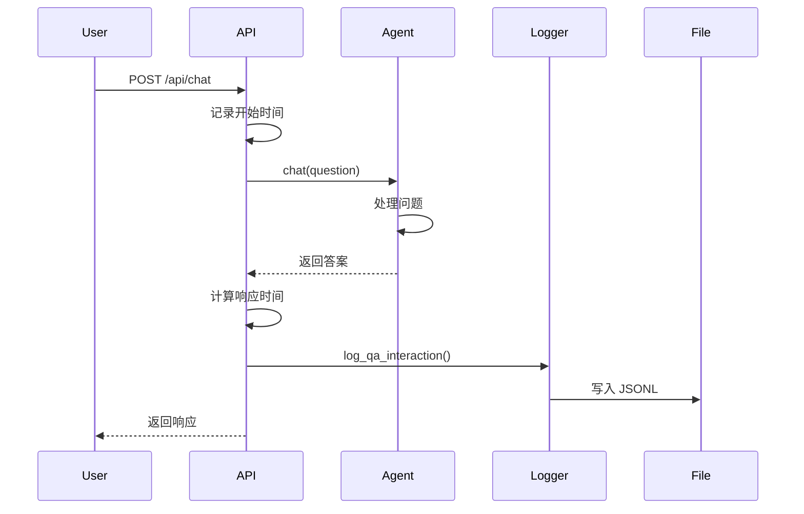
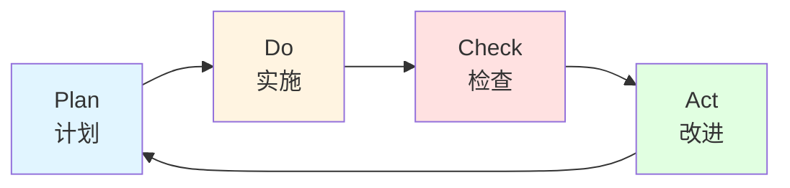

# 系统评估与监控体系

## 📋 目录

- [评估体系概述](#评估体系概述)
- [指标定义](#指标定义)
- [监控系统](#监控系统)
- [日志系统](#日志系统)
- [评估方法](#评估方法)
- [持续改进流程](#持续改进流程)

---

## 评估体系概述

本系统构建了**可评估、可迭代**的 LLM 应用评估体系，覆盖性能、质量、可靠性三个维度。

### 设计原则

1. **数据驱动** - 所有决策基于客观数据而非主观判断
2. **自动化** - 监控和评估自动进行，无需人工干预
3. **可追溯** - 每次问答都有完整日志记录
4. **可视化** - 通过 Dashboard 直观展示系统状态
5. **持续改进** - 从错误中学习，不断优化系统

### 评估维度



---

## 指标定义

### 1. 性能指标 (Performance Metrics)

#### 响应时间 (Response Time)
- **定义**: 从接收用户问题到返回答案的总时长
- **单位**: 毫秒 (ms)
- **目标值**:
  - 优秀: < 2000 ms
  - 良好: 2000-3000 ms
  - 可接受: 3000-5000 ms
  - 需优化: > 5000 ms
- **监控方式**: 每次请求自动记录

#### 平均响应时间 (Average Response Time)
- **定义**: 特定时间段内所有请求的平均响应时间
- **计算公式**: `∑(response_time) / total_requests`
- **追踪周期**: 每日、每周、每月

#### 响应时间分布 (Response Time Distribution)
- **P50** (中位数): 50% 的请求响应时间
- **P90**: 90% 的请求响应时间
- **P99**: 99% 的请求响应时间
- **用途**: 识别异常慢请求

### 2. 质量指标 (Quality Metrics)

#### 成功率 (Success Rate)
- **定义**: 成功处理的请求占总请求的比例
- **计算公式**: `successful_requests / total_requests × 100%`
- **目标值**:
  - 优秀: ≥ 95%
  - 良好: 90-95%
  - 可接受: 80-90%
  - 需改进: < 80%
- **监控方式**: 实时追踪

#### 工具使用准确率 (Tool Selection Accuracy)
- **定义**: Agent 正确选择工具的比例
- **评估方式**:
  - 人工标注测试集（100个问题）
  - 对比 Agent 选择的工具与预期工具
- **计算公式**: `correct_tool_selections / total_selections × 100%`

#### 数据准确性 (Data Accuracy)
- **定义**: 返回的客观数据与真实值的一致性
- **评估方式**:
  - 对比 Yahoo Finance 数据源
  - 验证知识库检索结果
- **目标**: 100% 准确（客观数据不允许错误）

### 3. 可靠性指标 (Reliability Metrics)

#### 系统可用性 (System Availability)
- **定义**: 系统正常运行时间占总时间的比例
- **计算公式**: `uptime / (uptime + downtime) × 100%`
- **目标值**: ≥ 99.9% (每月宕机时间 < 43 分钟)

#### 错误率 (Error Rate)
- **定义**: 发生错误的请求占总请求的比例
- **计算公式**: `failed_requests / total_requests × 100%`
- **目标值**: < 5%

#### 错误恢复时间 (Mean Time To Recovery, MTTR)
- **定义**: 从错误发生到系统恢复正常的平均时间
- **目标值**: < 5 分钟

---

## 监控系统

### 系统架构



### 监控组件

#### 1. 日志系统 (`logger.py`)

**功能**:
- 记录每次 QA 交互
- 追踪响应时间
- 记录成功/失败状态
- 捕获错误信息
- 存储工具使用情况

**日志格式** (JSONL):
```json
{
  "timestamp": "2026-03-15T14:32:45.123456",
  "question": "阿里巴巴最新股价？",
  "answer": "【数据来源】Yahoo Finance API...",
  "response_time_ms": 1523.45,
  "success": true,
  "tools_used": ["get_stock_price_tool"],
  "error_message": null,
  "metadata": {"model": "gpt-4"}
}
```

**文件位置**: `logs/qa_logs_YYYY-MM-DD.jsonl`

#### 2. 性能监控 (`monitor.py`)

**功能**:
- 聚合日志数据
- 计算性能指标
- 分析趋势变化
- 生成健康报告

**关键方法**:
- `get_realtime_metrics()` - 当前会话实时指标
- `get_daily_metrics()` - 每日统计数据
- `get_performance_trends()` - 性能趋势分析
- `get_tool_usage_stats()` - 工具使用统计
- `get_error_analysis()` - 错误分析
- `generate_health_report()` - 系统健康报告

#### 3. 监控 API 端点

| 端点 | 方法 | 功能 | 参数 |
|------|------|------|------|
| `/api/metrics` | GET | 实时指标 | - |
| `/api/metrics/today` | GET | 今日统计 | - |
| `/api/metrics/trends` | GET | 趋势分析 | `days=7` |
| `/api/metrics/tools` | GET | 工具使用统计 | `days=7` |
| `/api/metrics/errors` | GET | 错误分析 | `days=7` |
| `/api/dashboard` | GET | 监控面板数据 | - |
| `/api/health-report` | GET | 健康报告 | - |

#### 4. 错误分析脚本 (`scripts/analyze_errors.py`)

**功能**:
- 分析错误日志
- 识别错误模式
- 生成改进建议
- 导出分析报告

**使用方式**:
```bash
# 分析最近 7 天的错误
python scripts/analyze_errors.py --days 7

# 导出分析报告
python scripts/analyze_errors.py --days 7 --export
```

---

## 日志系统

### 日志记录流程



### 日志存储

**目录结构**:
```
logs/
├── qa_logs_2026-03-15.jsonl   # 当天日志
├── qa_logs_2026-03-14.jsonl   # 历史日志
├── qa_logs_2026-03-13.jsonl
└── error_analysis_2026-03-15.txt  # 错误分析报告
```

**日志轮转**: 按天切分，每天一个日志文件

**保留策略**: 建议保留最近 30 天日志

### 日志分析

#### 实时查询
```python
from ai_agent.logger import get_logger

logger = get_logger()

# 获取今日统计
stats = logger.get_statistics()
print(f"成功率: {stats['success_rate']*100:.2f}%")
print(f"平均响应时间: {stats['average_response_time_ms']:.2f} ms")

# 获取错误日志
errors = logger.get_error_logs()
for error in errors:
    print(f"错误: {error['error_message']}")
```

#### 离线分析
```bash
# 使用错误分析脚本
python scripts/analyze_errors.py --days 7 --export
```

---

## 评估方法

### 1. 自动化评估

#### 响应时间评估
- **方法**: 每次请求自动记录
- **频率**: 实时
- **阈值**: 2000 ms (优秀), 5000 ms (可接受)
- **告警**: 响应时间 > 5000 ms 时触发

#### 成功率评估
- **方法**: 统计成功/失败请求比例
- **频率**: 每日、每周、每月
- **阈值**: 成功率 < 90% 时需关注
- **告警**: 成功率 < 80% 时触发

### 2. 人工评估

#### 答案质量评估

创建测试集（推荐 100 个问题）:

```python
test_cases = [
    {
        "question": "阿里巴巴最新股价？",
        "expected_tool": "get_stock_price_tool",
        "quality_criteria": ["包含实时价格", "标注数据来源", "无编造数据"]
    },
    {
        "question": "什么是市盈率？",
        "expected_tool": "knowledge_base_qa",
        "quality_criteria": ["定义准确", "举例说明", "来自知识库"]
    },
    # ... 更多测试用例
]
```

**评估维度**:
1. **准确性** (40%) - 答案是否准确
2. **完整性** (30%) - 是否包含必要信息
3. **可读性** (20%) - 格式是否清晰
4. **数据来源标注** (10%) - 是否标注来源

**评分标准**: 1-5 分制
- 5 分: 优秀，完全满足标准
- 4 分: 良好，基本满足标准
- 3 分: 可接受，部分满足标准
- 2 分: 较差，需改进
- 1 分: 很差，不可用

### 3. A/B 测试

**场景**: 测试新 Prompt 版本效果

```python
# 对比测试
v2_results = test_with_prompt(test_cases, prompt_v2)
v3_results = test_with_prompt(test_cases, prompt_v3)

# 对比指标
compare_metrics(v2_results, v3_results)
# - 成功率: v2=75%, v3=90%
# - 平均响应时间: v2=2100ms, v3=1800ms
# - 工具选择准确率: v2=82%, v3=95%
```

---

## 持续改进流程

### 改进循环 (PDCA)



### 1. Plan (计划)

**数据收集**:
- 收集最近 7 天的日志数据
- 运行错误分析脚本
- 生成健康报告

**问题识别**:
```bash
# 运行分析
python scripts/analyze_errors.py --days 7 --export

# 查看报告
cat logs/error_analysis_2026-03-15.txt
```

**示例问题**:
- 成功率从 92% 降至 85%
- "市盈率"相关问题失败率高
- 响应时间P90 > 4000ms

### 2. Do (实施)

**制定改进方案**:

| 问题 | 原因分析 | 改进方案 |
|------|----------|----------|
| 成功率下降 | RAG 检索不准确 | 优化知识库文档质量 |
| "市盈率"问题失败 | 知识库缺少相关内容 | 添加金融术语词典 |
| 响应时间慢 | LLM 推理耗时 | 优化 Prompt，减少推理步骤 |

**实施改进**:
```bash
# 1. 更新知识库
# 添加更多金融术语解释

# 2. 优化 Prompt
# 修改 agent_core.py 中的 react_prompt

# 3. 重建索引
curl -X POST http://localhost:8000/api/rebuild-kb
```

### 3. Check (检查)

**效果验证**:

```python
# 对比改进前后指标
from ai_agent.monitor import get_monitor

monitor = get_monitor()

# 改进前（上周数据）
before = monitor.get_daily_metrics("2026-03-08")

# 改进后（本周数据）
after = monitor.get_daily_metrics("2026-03-15")

# 对比
print(f"成功率: {before['success_rate']:.2%} -> {after['success_rate']:.2%}")
print(f"响应时间: {before['average_response_time_ms']:.0f}ms -> {after['average_response_time_ms']:.0f}ms")
```

**目标达成判断**:
- ✅ 成功率回升至 90% 以上
- ✅ "市盈率"问题成功率 > 85%
- ✅ 响应时间P90 < 3500ms

### 4. Act (改进)

**记录经验**:
- 将有效的改进方案记录到文档
- 更新最佳实践
- 分享给团队

**标准化**:
- 将改进后的 Prompt 设为新基准
- 更新知识库维护规范
- 制定定期评估计划

---

## 监控 Dashboard 使用指南

### 启动服务

```bash
# 1. 启动后端 API
python start_api.py

# 2. 访问监控面板
# 方法1: 通过 API 获取 JSON 数据
curl http://localhost:8000/api/dashboard

# 方法2: 访问 Swagger UI
open http://localhost:8000/docs
```

### Dashboard 数据结构

```json
{
  "realtime": {
    "session_start": "2026-03-15T10:00:00",
    "total_requests": 45,
    "success_rate": 0.933,
    "average_response_time_ms": 1823.5
  },
  "today": {
    "date": "2026-03-15",
    "total_requests": 128,
    "success_rate": 0.921,
    "average_response_time_ms": 1956.3,
    "tools_usage": {
      "knowledge_base_qa": 56,
      "get_stock_price_tool": 42,
      "get_stock_history_tool": 18,
      "get_market_index_tool": 12
    }
  },
  "trends_7d": {
    "success_rate": {
      "values": [0.92, 0.91, 0.93, 0.89, 0.90, 0.92, 0.92],
      "average": 0.913,
      "trend": "improving"
    },
    "response_time_ms": {
      "values": [2100, 2050, 1980, 2200, 2100, 1950, 1900],
      "average": 2040,
      "trend": "improving"
    }
  },
  "health_report": {
    "health_status": "good",
    "health_score": 85,
    "recommendations": [
      "成功率低于95%，建议检查错误日志"
    ]
  }
}
```

### 关键指标解读

#### 健康状态 (Health Status)
- **excellent** (95+分): 系统运行优秀
- **good** (80-95分): 系统运行良好
- **fair** (60-80分): 系统基本正常，有改进空间
- **poor** (<60分): 系统需要优化

#### 趋势判断
- **improving**: 指标向好发展 ✅
- **declining**: 指标下降，需关注 ⚠️
- **stable**: 指标稳定 ➡️

---

## 最佳实践

### 1. 定期监控

**每日**:
- 查看今日成功率和响应时间
- 检查是否有异常错误

**每周**:
- 运行错误分析脚本
- 查看 7 天趋势
- 评估健康报告

**每月**:
- 人工评估答案质量（抽样 50 个问题）
- 对比月度指标变化
- 制定下月改进计划

### 2. 告警设置

建议设置以下告警：

| 指标 | 阈值 | 级别 |
|------|------|------|
| 成功率 | < 90% | Warning |
| 成功率 | < 80% | Critical |
| 平均响应时间 | > 3000ms | Warning |
| 平均响应时间 | > 5000ms | Critical |
| 错误率 | > 10% | Warning |
| 系统可用性 | < 99% | Critical |

### 3. 数据备份

**日志备份**:
```bash
# 每周备份日志
tar -czf logs_backup_$(date +%Y%m%d).tar.gz logs/

# 清理 30 天前的日志
find logs/ -name "qa_logs_*.jsonl" -mtime +30 -delete
```

---

## 总结

本评估体系实现了：

✅ **全面的指标覆盖** - 性能、质量、可靠性三维度
✅ **自动化监控** - 无需人工干预，实时追踪
✅ **数据驱动决策** - 基于客观数据优化系统
✅ **持续改进流程** - PDCA 循环，不断提升
✅ **完整的工具链** - 日志、监控、分析、报告

这套体系充分展示了：
- **可评估**: 明确的指标定义和评估方法
- **可迭代**: 完整的改进循环和验证机制
- **工程化**: 自动化工具和标准化流程

符合"构建可评估、可迭代的模型使用流程"的岗位要求。

---

**创建时间**: 2026-03-15
**项目**: 金融资产问答系统
**版本**: 1.0
