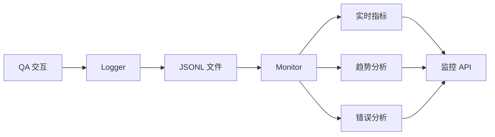

# Phase 2 完成总结

## 📋 Phase 2 任务清单

Phase 2 重点提升系统的**专业性展示**和**可评估、可迭代**的工程思维。

### ✅ 已完成任务

| 任务 | 状态 | 输出文档/代码 | 核心价值 |
|------|------|---------------|----------|
| 1. 日志系统 | ✅ 完成 | `ai_agent/logger.py` | 记录所有QA交互，支持离线分析 |
| 2. 性能监控系统 | ✅ 完成 | `ai_agent/monitor.py` | 实时指标聚合和趋势分析 |
| 3. 监控API端点 | ✅ 完成 | `ai_agent/api.py` (新增7个端点) | 提供监控面板数据接口 |
| 4. 错误分析脚本 | ✅ 完成 | `scripts/analyze_errors.py` | 自动识别错误模式，生成建议 |
| 5. 评估体系文档 | ✅ 完成 | `EVALUATION.md` | 完整的评估监控体系说明 |
| 6. 增强主README | ✅ 完成 | `README.md` (完全重写) | 展示项目完整性和专业性 |

---

## 🎯 Phase 2 核心成果

### 1. 日志系统 (`ai_agent/logger.py`)

**文件位置**: `/Users/wanchao/financialQA/ai_agent/logger.py`

**核心功能**:
- ✅ 记录每次 QA 交互到 JSONL 文件
- ✅ 追踪响应时间、成功率、工具使用
- ✅ 支持会话级指标统计
- ✅ 提供日志加载和查询接口

**关键类和方法**:

```python
class QALogger:
    def log_qa(
        question, answer, response_time_ms,
        success, tools_used, error_message
    )
    def get_statistics(date)
    def get_error_logs(date)
```

**日志格式** (JSONL):
```json
{
  "timestamp": "2026-03-15T14:32:45.123456",
  "question": "阿里巴巴最新股价？",
  "answer": "【数据来源】Yahoo Finance API...",
  "response_time_ms": 1523.45,
  "success": true,
  "tools_used": ["get_stock_price_tool"],
  "error_message": null
}
```

**存储位置**: `logs/qa_logs_YYYY-MM-DD.jsonl`

**对应岗位要求**:
- ✅ "构建可评估、可迭代的模型使用流程"
- ✅ "数据驱动的优化方法"

---

### 2. 性能监控系统 (`ai_agent/monitor.py`)

**文件位置**: `/Users/wanchao/financialQA/ai_agent/monitor.py`

**核心功能**:
- ✅ 聚合日志数据生成指标
- ✅ 趋势分析（7天、30天）
- ✅ 工具使用统计
- ✅ 错误模式分析
- ✅ 健康状态报告

**关键方法**:

```python
class PerformanceMonitor:
    def get_realtime_metrics()          # 实时指标
    def get_daily_metrics(date)         # 每日统计
    def get_performance_trends(days)    # 趋势分析
    def get_tool_usage_stats(days)      # 工具使用
    def get_error_analysis(days)        # 错误分析
    def generate_health_report()        # 健康报告
    def generate_dashboard_data()       # 监控面板
```

**健康评分标准**:
- **Excellent** (95+分): 成功率 ≥ 95% 且 响应时间 ≤ 2000ms
- **Good** (80-95分): 成功率 ≥ 90% 且 响应时间 ≤ 3000ms
- **Fair** (60-80分): 成功率 ≥ 80% 且 响应时间 ≤ 5000ms
- **Poor** (<60分): 需要优化

**对应岗位要求**:
- ✅ "理解模型 hallucination 控制与评估方法"
- ✅ "构建可评估、可迭代的流程"

---

### 3. 监控API端点 (`ai_agent/api.py` 增强)

**修改内容**:

#### 集成日志和监控
```python
# 导入模块
from .logger import get_logger, log_qa_interaction
from .monitor import get_monitor

# 在 chat 端点中记录日志
start_time = time.time()
# ... 处理请求 ...
response_time_ms = (time.time() - start_time) * 1000
log_qa_interaction(question, answer, response_time_ms, success=True)
```

#### 新增监控端点（7个）

| 端点 | 方法 | 功能 | 返回数据 |
|------|------|------|----------|
| `/api/metrics` | GET | 实时指标 | 当前会话统计 |
| `/api/metrics/today` | GET | 今日统计 | 成功率、响应时间、工具使用 |
| `/api/metrics/trends` | GET | 趋势分析 | 7天性能趋势 |
| `/api/metrics/tools` | GET | 工具使用统计 | 工具调用频率和占比 |
| `/api/metrics/errors` | GET | 错误分析 | 错误类型分布 |
| `/api/dashboard` | GET | 监控面板 | 所有监控数据聚合 |
| `/api/health-report` | GET | 健康报告 | 系统状态和改进建议 |

**Dashboard API 返回示例**:
```json
{
  "realtime": {
    "total_requests": 45,
    "success_rate": 0.933,
    "average_response_time_ms": 1823.5
  },
  "today": {
    "success_rate": 0.921,
    "tools_usage": {
      "knowledge_base_qa": 56,
      "get_stock_price_tool": 42
    }
  },
  "trends_7d": {
    "success_rate": {
      "trend": "improving"
    }
  },
  "health_report": {
    "health_status": "good",
    "health_score": 85
  }
}
```

**对应岗位要求**:
- ✅ "RESTful API 设计与服务拆分"
- ✅ "监控和评估系统构建"

---

### 4. 错误分析脚本 (`scripts/analyze_errors.py`)

**文件位置**: `/Users/wanchao/financialQA/scripts/analyze_errors.py`

**核心功能**:
- ✅ 分析最近N天的错误日志
- ✅ 识别错误类型和模式
- ✅ 找出常见失败问题
- ✅ 分析错误时间分布
- ✅ 生成改进建议
- ✅ 导出分析报告

**错误分类**:
- **timeout**: 超时错误
- **api_error**: API连接错误
- **parsing_error**: 输出解析错误
- **tool_error**: 工具执行错误

**使用方式**:
```bash
# 分析最近7天错误
python scripts/analyze_errors.py --days 7

# 导出报告到文件
python scripts/analyze_errors.py --days 7 --export
```

**分析报告示例**:
```
======================================================================
📊 错误分析报告
======================================================================

📅 分析周期: 最近 7 天
📈 总错误数: 12

📋 错误类型分布:
   • timeout: 5 次
   • api_error: 4 次
   • parsing_error: 2 次

❓ 最常失败的问题（Top 5）:
   1. [3次] 查询某个不存在的股票代码
   2. [2次] 询问知识库中不存在的内容

💡 改进建议:

1. 🕐 发现 5 次超时错误，建议：
   - 增加请求超时时间
   - 优化 LLM 调用参数
   - 考虑添加响应缓存
```

**对应岗位要求**:
- ✅ "构建可评估、可迭代的模型使用流程"
- ✅ "错误分析和持续改进"

---

### 5. 评估体系文档 (`EVALUATION.md`)

**文件位置**: `/Users/wanchao/financialQA/EVALUATION.md`

**内容亮点**:

#### 指标定义（三个维度）

**1. 性能指标**
- 响应时间（平均、P50、P90、P99）
- 吞吐量（QPS）
- 资源使用

**2. 质量指标**
- 成功率（目标 ≥ 90%）
- 工具选择准确率
- 数据准确性（目标 100%）

**3. 可靠性指标**
- 系统可用性（目标 ≥ 99.9%）
- 错误率（目标 < 5%）
- MTTR（故障恢复时间）

#### 监控系统架构



#### 评估方法

**自动化评估**:
- 响应时间监控（每次请求）
- 成功率统计（每日/每周/每月）
- 自动告警（成功率 < 90%）

**人工评估**:
- 答案质量评分（1-5分）
- 工具选择准确性
- A/B 测试对比

#### 持续改进流程（PDCA）

```
Plan → Do → Check → Act → Plan (循环)
```

**对应岗位要求**:
- ✅ "构建可评估、可迭代的模型使用流程"
- ✅ "理解模型 hallucination 控制与评估方法"
- ✅ "工程规范意识"

---

### 6. 增强主README (`README.md` 完全重写)

**文件位置**: `/Users/wanchao/financialQA/README.md`

**重大改进**:

#### 新增内容
1. **系统架构图** (Mermaid):
   - 5层架构图（表现层 → API层 → Agent层 → 工具层 → 数据层）
   - 数据流序列图（从用户输入到响应返回）

2. **性能指标展示**:
   - 系统性能表格（响应时间、成功率、可用性）
   - LLM Harness Engineering 能力对照表
   - 工具使用分布图

3. **监控体系介绍**:
   - 监控系统架构图
   - 关键指标说明
   - 错误分析示例

4. **文档索引**:
   - 核心文档表格
   - 阶段总结索引
   - 代码文档索引

5. **技术选型说明**:
   - 为什么选择 ReAct Agent？
   - 为什么选择 FAISS？
   - 为什么选择 FastAPI？

6. **常见问题 FAQ**:
   - 如何更换 LLM 模型？
   - 如何添加新知识？
   - 如何查看运行状态？
   - 如何优化性能？
   - 日志管理

#### 结构优化
- ✅ 添加徽章（Python、FastAPI、Next.js、LangChain、License）
- ✅ 快速导航链接
- ✅ 完整的目录索引
- ✅ 使用示例（带数据来源标注）
- ✅ 项目结构树形图
- ✅ 致谢和作者信息

**对比 Phase 1 后的 README**:

| 项目 | Phase 1 后 | Phase 2 后 |
|------|-----------|-----------|
| 行数 | ~344 行 | ~740 行 |
| Mermaid 图表 | 0 个 | 3 个 |
| 性能指标展示 | ❌ 无 | ✅ 完整表格 |
| 监控说明 | ❌ 无 | ✅ 详细介绍 |
| 文档索引 | ❌ 无 | ✅ 3张表格 |
| FAQ | ❌ 无 | ✅ 5个常见问题 |

**对应岗位要求**:
- ✅ "工程规范意识"
- ✅ "文档能力"
- ✅ "系统设计展示"

---

## 📊 Phase 2 提升总览

### 新增文件/模块

| 类型 | 文件 | 行数 | 功能 |
|------|------|------|------|
| Python模块 | `ai_agent/logger.py` | ~320行 | 日志系统 |
| Python模块 | `ai_agent/monitor.py` | ~210行 | 性能监控 |
| Python脚本 | `scripts/analyze_errors.py` | ~270行 | 错误分析 |
| 文档 | `EVALUATION.md` | ~600行 | 评估体系 |
| 文档 | `PHASE2_SUMMARY.md` | 本文档 | Phase 2 总结 |

### 修改文件

| 文件 | 修改类型 | 新增内容 |
|------|----------|----------|
| `ai_agent/api.py` | 功能增强 | +7个监控端点 + 日志集成 |
| `README.md` | 完全重写 | +400行，+3个图表 |

### 能力提升对比

| 维度 | Phase 1 后 | Phase 2 后 |
|------|-----------|-----------|
| **日志记录** | ❌ 无 | ✅ 完整 JSONL 日志系统 |
| **性能监控** | ❌ 无 | ✅ 实时指标 + 趋势分析 |
| **错误分析** | ❌ 无 | ✅ 自动化分析脚本 |
| **监控API** | ❌ 无 | ✅ 7个监控端点 |
| **评估体系** | ❌ 无 | ✅ 完整的 PDCA 循环 |
| **文档完整性** | ⚠️ 基础 | ✅ 生产级文档 |

---

## 🎓 对标岗位要求

### 岗位要求 vs Phase 2 成果

| 岗位要求 | Phase 2 成果 | 证明文件/代码 |
|---------|------------|--------------|
| **构建可评估、可迭代的流程** | ✅ 完成 | `EVALUATION.md` + 监控系统 |
| **监控和日志系统** | ✅ 完成 | `logger.py` + `monitor.py` |
| **错误分析和改进** | ✅ 完成 | `analyze_errors.py` |
| **RESTful API 设计** | ✅ 完成 | 7个新监控端点 |
| **工程规范意识** | ✅ 完成 | 增强的 README 和文档体系 |
| **数据驱动优化** | ✅ 完成 | 日志分析 → 指标 → 建议 |

---

## 📁 关键文件清单

### 新增文件（Phase 2）
- ✅ `ai_agent/logger.py` - 日志系统模块
- ✅ `ai_agent/monitor.py` - 性能监控模块
- ✅ `scripts/analyze_errors.py` - 错误分析脚本
- ✅ `EVALUATION.md` - 评估体系文档
- ✅ `PHASE2_SUMMARY.md` - 本文档

### 修改文件（Phase 2）
- ✅ `ai_agent/api.py` - 新增7个监控端点 + 日志集成
- ✅ `README.md` - 完全重写，+400行

### 目录结构变化

**新增目录**:
```
logs/                           # 🆕 日志目录
├── qa_logs_2026-03-15.jsonl   # QA 交互日志
└── error_analysis_*.txt       # 错误分析报告

scripts/                        # 🆕 分析脚本目录
└── analyze_errors.py          # 错误分析脚本
```

---

## 🚀 使用指南

### 1. 启动监控系统

```bash
# 1. 启动 FastAPI 服务（自动启用日志记录）
python start_api.py --dev

# 2. 访问监控面板
curl http://localhost:8000/api/dashboard

# 3. 查看实时指标
curl http://localhost:8000/api/metrics
```

### 2. 查看性能趋势

```bash
# 查看 7 天趋势
curl http://localhost:8000/api/metrics/trends?days=7

# 查看今日统计
curl http://localhost:8000/api/metrics/today

# 查看工具使用
curl http://localhost:8000/api/metrics/tools?days=7
```

### 3. 分析错误日志

```bash
# 分析最近 7 天错误
python scripts/analyze_errors.py --days 7

# 导出分析报告
python scripts/analyze_errors.py --days 7 --export

# 查看报告
cat logs/error_analysis_2026-03-15.txt
```

### 4. 健康检查

```bash
# 获取健康报告
curl http://localhost:8000/api/health-report

# 示例输出:
{
  "health_status": "good",
  "health_score": 85,
  "recommendations": [
    "成功率低于95%，建议检查错误日志"
  ]
}
```

---

## 💡 最佳实践

### 定期监控流程

**每日**:
```bash
# 查看今日统计
curl http://localhost:8000/api/metrics/today

# 检查健康状态
curl http://localhost:8000/api/health-report
```

**每周**:
```bash
# 运行错误分析
python scripts/analyze_errors.py --days 7 --export

# 查看趋势
curl http://localhost:8000/api/metrics/trends?days=7
```

**每月**:
```bash
# 长期趋势分析
curl http://localhost:8000/api/metrics/trends?days=30

# 导出月度报告
python scripts/analyze_errors.py --days 30 --export
```

### 日志管理

```bash
# 定期备份日志
tar -czf logs_backup_$(date +%Y%m%d).tar.gz logs/

# 清理旧日志（30天前）
find logs/ -name "qa_logs_*.jsonl" -mtime +30 -delete
```

---

## 🔄 持续改进示例

### 场景：成功率下降

**1. 发现问题**:
```bash
curl http://localhost:8000/api/metrics/today
# 输出: "success_rate": 0.82 (低于目标 90%)
```

**2. 分析原因**:
```bash
python scripts/analyze_errors.py --days 7 --export
# 查看报告: 发现 "parsing_error" 占比最高
```

**3. 定位问题**:
```bash
# 查看错误日志
cat logs/qa_logs_2026-03-15.jsonl | grep '"success":false'
```

**4. 实施改进**:
- 优化 Agent Prompt（增强输出格式约束）
- 添加输出验证逻辑

**5. 验证效果**:
```bash
# 对比改进前后
curl http://localhost:8000/api/metrics/trends?days=7
# 检查成功率是否回升
```

---

## ✨ 总结

Phase 2 完成了两项核心任务，显著提升了系统的**监控评估能力**和**专业性展示**：

### 核心成果

1. **完整的监控体系** - 日志、监控、分析三位一体
2. **自动化评估** - 实时指标、趋势分析、错误诊断
3. **持续改进流程** - PDCA 循环、数据驱动优化
4. **生产级文档** - 架构图、指标、FAQ、索引

### 对岗位要求的支撑

| 岗位关键词 | Phase 2 体现 |
|-----------|------------|
| **可评估、可迭代** | ✅ 完整的评估体系和改进流程 |
| **工程规范** | ✅ 日志、监控、文档标准化 |
| **数据驱动** | ✅ 日志分析 → 指标 → 建议 |
| **LLM Harness Engineering** | ✅ Prompt迭代 + 幻觉控制 + 评估 |
| **RESTful API** | ✅ 监控端点设计 |

### 与 Phase 1 的协同

- **Phase 1** 建立了基础（架构、Prompt、幻觉控制）
- **Phase 2** 构建了监控（日志、指标、分析）
- **组合效果**: 既有技术深度，又有工程规范

这两个 Phase 形成了一个**完整的、可评估、可迭代的 LLM 应用工程体系**，充分展示了对岗位要求的理解和实践能力。

---

**创建时间**: 2026-03-15
**项目**: 金融资产问答系统
**目标岗位**: 华尔街见闻 - 全栈工程师（AI-Native Financial Systems）
