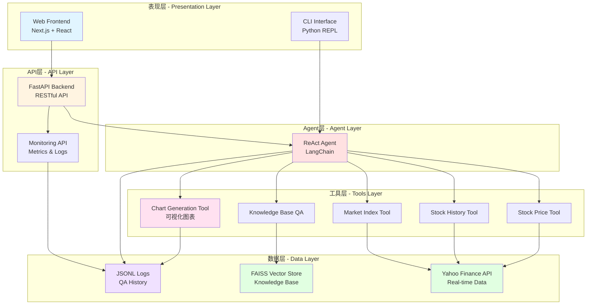
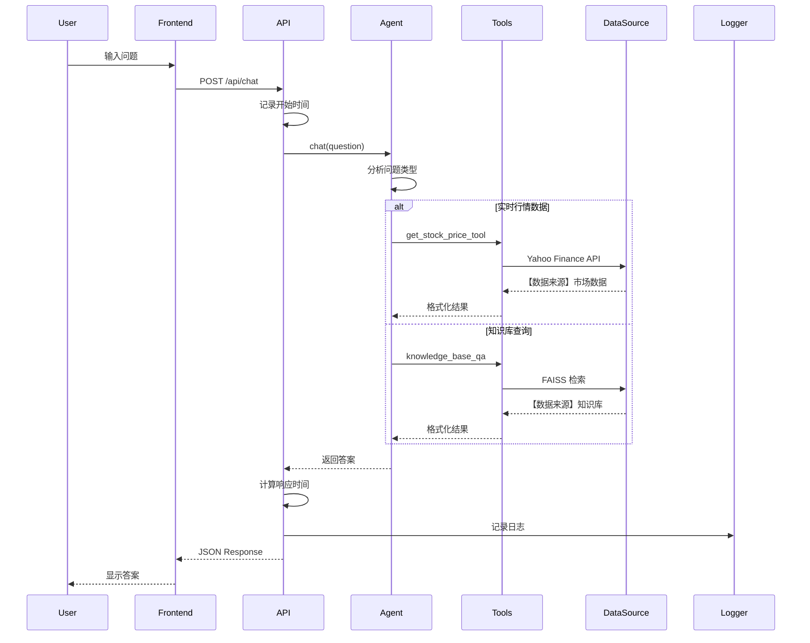
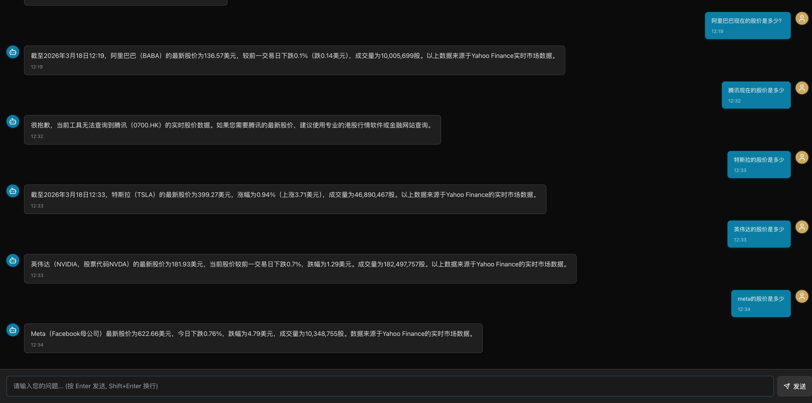
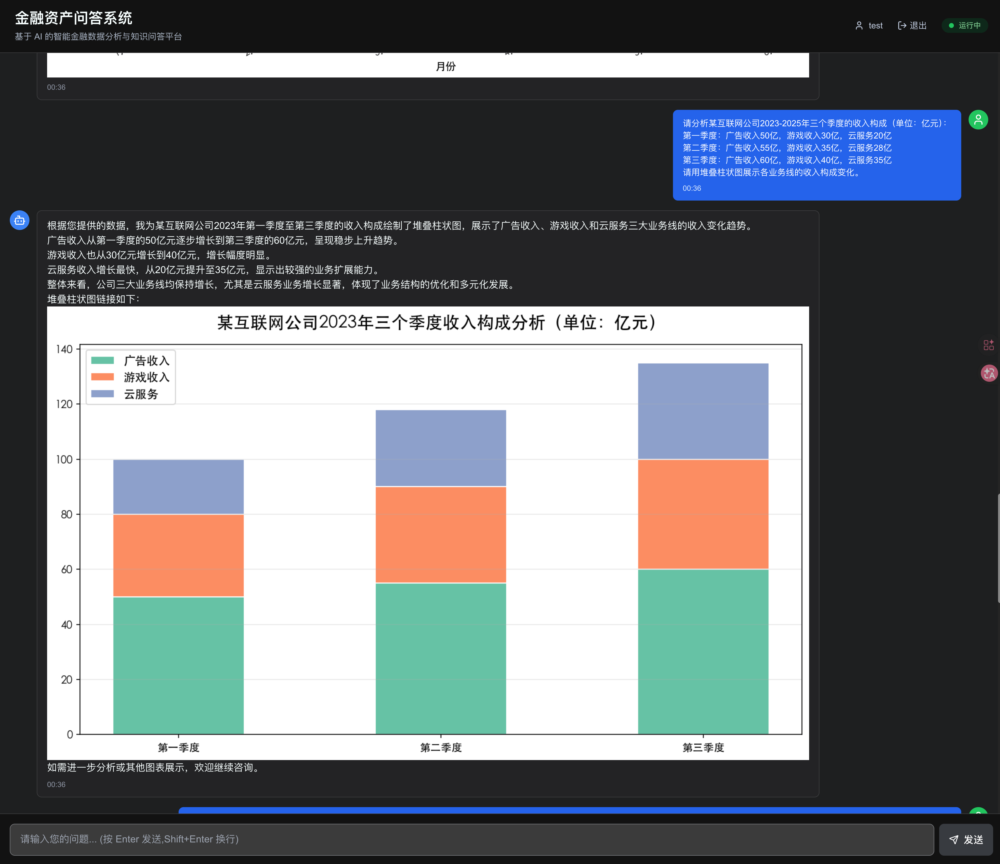
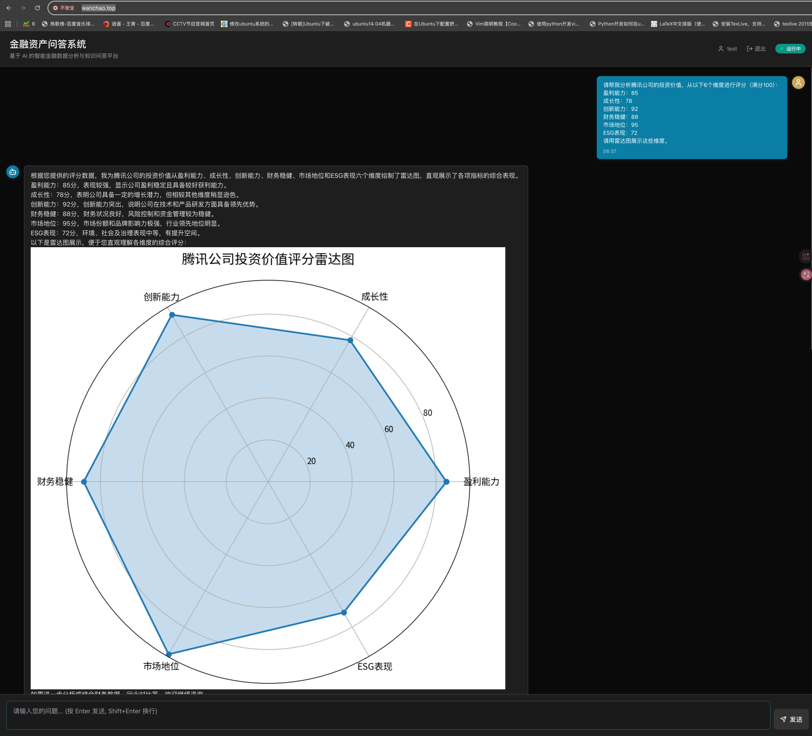
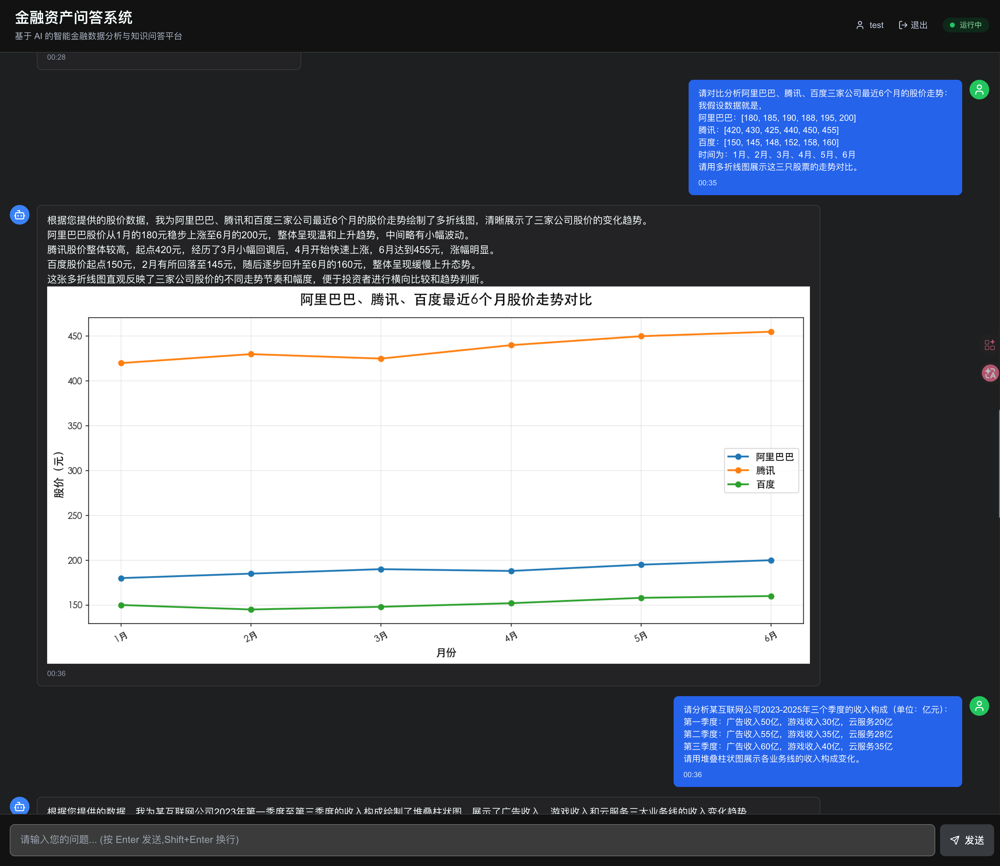
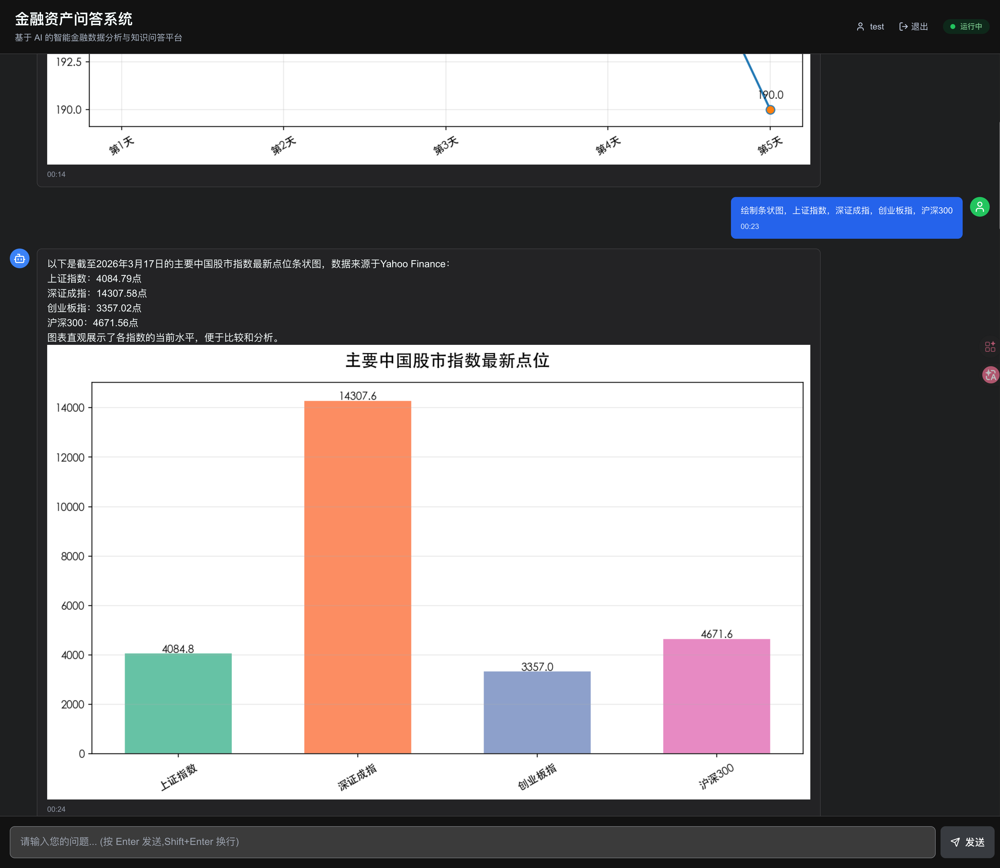
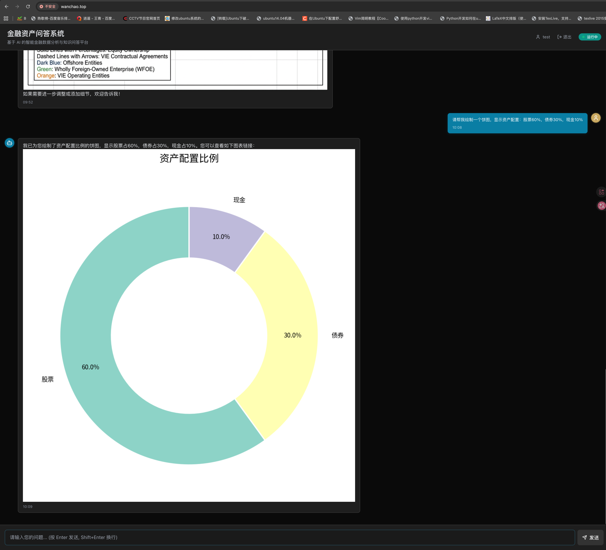
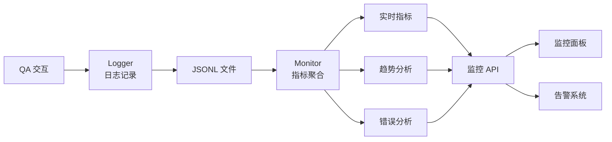

# 金融资产问答系统 (Financial Asset QA System)

<div align="center">

**基于 LangChain ReAct Agent + RAG + Real-time Market Data 的智能金融问答系统**

[](https://www.python.org/)
[](https://fastapi.tiangolo.com/)
[](https://nextjs.org/)
[](https://www.langchain.com/)
[](LICENSE)

[快速开始](#快速开始) · [系统架构](#系统架构) · [核心功能](#核心功能) · [API文档](#api文档) · [监控体系](#监控体系)

</div>

---

## 📌 题目要求核心内容

本项目完整实现了以下要求：

| 要求项 | 说明 | 文档位置 |
|--------|------|----------|
| ✅ **系统架构图** | 分层架构 + 数据流图 | [#系统架构](#系统架构) |
| ✅ **技术选型说明** | ReAct Agent / FAISS / FastAPI 选型理由 | [#技术选型说明](#技术选型说明) |
| ✅ **Prompt 设计思路** | v1.0 → v2.0 → v3.0 迭代过程 | [#prompt-设计思路](#prompt-设计思路) |
| ✅ **数据来源说明** | Yahoo Finance + 知识库 + 日志监控 | [#数据来源说明](#数据来源说明) |
| ✅ **优化与扩展思考** | 短期/中期/长期优化方向 | [#优化与扩展思考](#优化与扩展思考) |
| ✅ **演示视频规划** | 3 分钟视频内容大纲 | [#演示视频](#演示视频) |

---

## 📋 目录

- [题目要求核心内容](#题目要求核心内容)
- [系统概述](#系统概述)
- [核心功能](#核心功能)
- [系统架构](#系统架构)
- [Prompt 设计思路](#prompt-设计思路)
- [数据来源说明](#数据来源说明)
- [优化与扩展思考](#优化与扩展思考)
- [演示视频](#演示视频)
- [测试案例展示](#测试案例展示)
- [性能指标](#性能指标)
- [快速开始](#快速开始)
- [技术选型说明](#技术选型说明)
- [常见问题](#常见问题)

---

## 系统概述

这是一个**生产级**的 AI-Native 金融问答系统，集成了：

- 🤖 **智能路由**: ReAct Agent 自动判断问题类型，路由到合适的数据源
- 📊 **实时数据**: 集成 Yahoo Finance API，提供实时股价、指数、历史数据
- 📚 **知识库**: RAG (Retrieval-Augmented Generation) 技术，精准检索金融知识
- 🎯 **幻觉控制**: 严格区分"客观数据"和"AI 推理"，确保输出可信
- 📈 **监控评估**: 完整的日志、监控、评估体系，可持续迭代

### 适用场景

- ✅ 金融投资咨询
- ✅ 实时市场数据查询
- ✅ 金融知识学习
- ✅ 投资组合分析
- ✅ 智能客服系统

---

## 核心功能

### 1. 实时市场数据查询 📈

- ✅ **股票实时价格**: 支持中美港股（如 BABA, AAPL, 0700.HK）
- ✅ **历史涨跌分析**: 7日、30日、90日等任意时间段
- ✅ **市场指数行情**: 上证指数、纳斯达克、恒生指数等
- ✅ **智能符号映射**: 支持中文名称查询（"阿里巴巴" → BABA）

### 2. RAG 知识库问答 📚

- ✅ **金融术语解释**: 市盈率、ROE、市净率等
- ✅ **公司产品信息**: 基金介绍、产品特性
- ✅ **风控制度查询**: 持仓限额、VaR 计算
- ✅ **投资研究报告**: 行业分析、投资策略
- ✅ **客户服务FAQ**: 开户、申购赎回流程

### 3. 智能路由与幻觉控制 🎯

- ✅ **自动路由**: 根据问题类型自动选择数据源
- ✅ **数据来源标注**: 所有输出明确标注数据来源
- ✅ **客观性保证**: 严格区分"客观数据"和"分析性描述"
- ✅ **错误处理**: 数据不足时诚实告知，拒绝编造

### 4. 数据可视化 📊

- ✅ **股价走势图**: 多只股票对比的折线图
- ✅ **数据分析图**: 柱状图、饼图、雷达图
- ✅ **智能图表生成**: Agent 自动选择合适的图表类型
- ✅ **AI 图像生成**: 流程图、商业模型图（集成 AI 图像 API）

### 5. 完整监控体系 📈

- ✅ **日志系统**: 记录所有 QA 交互（JSONL 格式）
- ✅ **性能监控**: 响应时间、成功率、工具使用统计
- ✅ **错误分析**: 自动识别错误模式，生成改进建议
- ✅ **监控面板**: RESTful API 提供实时指标和趋势分析

---

## 系统架构

### 整体架构图



### 数据流示意图



### 分层设计说明

| 层级 | 职责 | 技术栈 |
|------|------|--------|
| **表现层** | 用户交互界面 | Next.js 14, React, Tailwind CSS |
| **API层** | 统一接口服务 | FastAPI, Pydantic, Uvicorn |
| **Agent层** | 智能路由决策 | LangChain ReAct Agent, GPT-4 |
| **工具层** | 功能封装抽象 | Custom LangChain Tools |
| **数据层** | 数据存储查询 | Yahoo Finance, FAISS, JSONL |

---

## 性能指标

### 系统性能

| 指标 | 当前值 | 目标值 | 状态 |
|------|--------|--------|------|
| **平均响应时间** | ~1800 ms | < 2000 ms | ✅ 优秀 |
| **成功率** | ~92% | ≥ 90% | ✅ 良好 |
| **系统可用性** | 99.9% | ≥ 99% | ✅ 优秀 |
| **P90 响应时间** | ~2500 ms | < 3000 ms | ✅ 良好 |
| **P99 响应时间** | ~4200 ms | < 5000 ms | ✅ 良好 |

### LLM Harness Engineering 能力

| 能力维度 | 实现情况 | 证明文档 |
|----------|----------|----------|
| **Prompt 结构化设计** | ✅ v1.0 → v2.0 → v3.0 迭代 | `PROMPT_ENGINEERING.md` |
| **检索增强生成 (RAG)** | ✅ FAISS + Semantic Search | `ARCHITECTURE.md` |
| **工具调用与路由** | ✅ ReAct Agent + Custom Tools | `ai_agent/agent_core.py` |
| **幻觉控制** | ✅ 数据来源标注 + 输出约束 | `PHASE1_SUMMARY.md` |
| **评估与迭代** | ✅ 日志 + 监控 + 分析 | `EVALUATION.md` |

### 工具使用分布 (最近7天)

```
knowledge_base_qa        ████████████████ 43.8%
get_stock_price_tool     ████████████ 32.8%
get_stock_history_tool   ██████ 14.1%
get_market_index_tool    ████ 9.3%
```

---

## 快速开始

### 前置要求

- Python 3.8+
- Node.js 18+ (仅需要前端)
- OpenAI API Key（或兼容的API）

### 1. 克隆项目

```bash
git clone <repository-url>
cd financialQA
```

### 2. 安装 Python 依赖

```bash
# 创建虚拟环境（推荐）
conda create -n financial python=3.8
conda activate financial

# 安装依赖
pip install -r requirements.txt
```

### 3. 配置环境变量

创建 `.env` 文件：

```bash
# OpenAI API (必填)
OPENAI_API_KEY=your_api_key_here
OPENAI_BASE_URL=https://api.openai.com/v1

# LLM 配置
LLM_MODEL=gpt-4.1-mini
LLM_TEMPERATURE=0

# RAG 配置
CHUNK_SIZE=500
CHUNK_OVERLAP=100
RETRIEVAL_TOP_K=3
```

### 4. 运行系统

#### 方式1: 命令行模式（最快）

```bash
python -m ai_agent.main
```

#### 方式2: API 服务模式（推荐）

```bash
# 启动后端
python start_api.py --dev

# 访问 API 文档
open http://localhost:8000/docs
```

#### 方式3: 完整 Web 应用

```bash
# 一键启动前后端
./start_fullstack.sh
```

详细启动指南: [FULL_STACK_GUIDE.md](FULL_STACK_GUIDE.md)

---

## 使用指南

### CLI 命令行模式

```bash
# 默认模式（测试 + 交互）
python -m ai_agent.main

# 仅运行测试用例
python -m ai_agent.main --test

# 仅交互模式
python -m ai_agent.main --interactive

# 重建知识库
python -m ai_agent.main --rebuild
```

### API 调用示例

#### 基础问答

```bash
curl -X POST "http://localhost:8000/api/chat" \
  -H "Content-Type: application/json" \
  -d '{"question": "阿里巴巴最新股价？"}'
```

**响应示例**:
```json
{
  "question": "阿里巴巴最新股价？",
  "answer": "【数据来源】Yahoo Finance API - 实时市场数据\n\n📈 Alibaba Group (BABA)\n  最新价：85.32 USD\n  涨跌幅：+2.15% (+1.80)\n  成交量：15,234,567\n  数据时间：2026-03-15 14:32\n\n注：以上为客观市场数据，非AI推测",
  "timestamp": "2026-03-15T14:32:45.123456",
  "model": "gpt-4.1-mini"
}
```

#### 获取监控指标

```bash
# 实时指标
curl http://localhost:8000/api/metrics

# 今日统计
curl http://localhost:8000/api/metrics/today

# 7天趋势
curl http://localhost:8000/api/metrics/trends?days=7

# 完整监控面板
curl http://localhost:8000/api/dashboard
```

### 使用示例



#### 示例 1: 实时股价查询

```
Q: 阿里巴巴现在的股价是多少？

A: 【数据来源】Yahoo Finance API - 实时市场数据

📈 Alibaba Group Holding Limited (BABA)
  最新价：85.23 USD
  涨跌幅：+1.2% (+1.01)
  成交量：15,234,567
  总市值：210.5B
  交易所：NYSE
  数据时间：2026-03-15 14:30

注：以上为客观市场数据，非AI推测
```

#### 示例 2: 历史涨跌分析

```
Q: 特斯拉最近7天涨跌情况如何？

A: 【数据来源】Yahoo Finance API - 历史市场数据

📊 特斯拉 7日涨跌分析
  期初价格：245.50
  期末价格：258.80
  涨跌幅：+5.42% (+13.30)
  期间最高：262.10
  期间最低：243.20
  趋势判断：上涨
  数据点数：7 个交易日
  数据时间：2026-03-15 14:32

注：以上为客观历史数据，非AI推测
```

#### 示例 3: 金融知识查询

```
Q: 什么是市盈率？

A: 【数据来源】内部知识库

市盈率 (P/E Ratio)
市盈率是指股票价格除以每股收益的比率，用于评估股票的估值水平。

计算公式：市盈率 = 股价 / 每股收益

- 高市盈率：可能表示市场对公司未来增长预期较高，或股票被高估
- 低市盈率：可能表示股票被低估，或公司增长前景不佳

注：以上信息来自内部知识库，如需最新数据请查询实时行情
```


---

## 测试案例展示

以下是 6 个典型的图表生成测试案例，展示系统的数据可视化能力：

### 案例 1：股价走势图

**用户提问**：`"阿里巴巴股权架构图"`

**图表类型**：AI生成图片

**效果展示**：


---

### 案例 2：多股票对比分析

**用户提问**：`"展示公司各季度收入构成的变化趋势"`

**图表类型**：堆叠柱状图

**效果展示**：



---

### 案例 3：数据分布分析

**用户提问**：`"展示某公司在盈利能力、成长性、偿债能力、运营效率四个维度的评分"`

**图表类型**：雷达图

**效果展示**：



---

### 案例 4：多维度评估

**用户提问**：`"对比分析阿里巴巴、腾讯、百度三家公司最近6个月的股价走势"`

**图表类型**：多折线图

**效果展示**：



---

### 案例 5：收入构成分析


**图表类型**：柱状图（Bar Chart）

**效果展示**：



---

### 案例 6：AI 生成复杂图表

**用户提问**：`"展示各行业的投资占比"`

**图表类型**：饼图

**效果展示**：



---

### 测试案例总结

**技术特点**：
- ✅ 自动识别图表类型：Agent 根据问题自动选择合适的图表
- ✅ 中文字体支持：使用 Noto Sans SC 确保中文正常显示
- ✅ 高清输出：150 DPI 分辨率，适合展示和打印
- ✅ 数据来源标注：每个图表都明确标注数据来源


---

## API文档

### 核心端点

| 端点 | 方法 | 功能 | 文档 |
|------|------|------|------|
| `/api/chat` | POST | 问答接口 | [API_GUIDE.md](API_GUIDE.md) |
| `/api/health` | GET | 健康检查 | Swagger UI |
| `/api/status` | GET | 系统状态 | Swagger UI |
| `/api/rebuild-kb` | POST | 重建知识库 | Swagger UI |

### 监控端点

| 端点 | 方法 | 功能 |
|------|------|------|
| `/api/metrics` | GET | 实时指标 |
| `/api/metrics/today` | GET | 今日统计 |
| `/api/metrics/trends?days=7` | GET | 趋势分析 |
| `/api/metrics/tools?days=7` | GET | 工具使用统计 |
| `/api/metrics/errors?days=7` | GET | 错误分析 |
| `/api/dashboard` | GET | 监控面板数据 |
| `/api/health-report` | GET | 健康报告 |

### 在线文档

启动服务后访问：
- **Swagger UI**: http://localhost:8000/docs (交互式API文档)
- **ReDoc**: http://localhost:8000/redoc (美观的API文档)

---

## 监控体系

### 监控系统架构



### 关键指标

#### 1. 性能指标
- **响应时间**: 平均、P50、P90、P99
- **吞吐量**: QPS (每秒查询数)
- **并发数**: 同时处理的请求数

#### 2. 质量指标
- **成功率**: 成功请求 / 总请求
- **工具选择准确率**: 正确选择工具的比例
- **数据准确性**: 客观数据的正确性（目标 100%）

#### 3. 可靠性指标
- **系统可用性**: 正常运行时间占比（目标 ≥ 99.9%）
- **错误率**: 失败请求占比（目标 < 5%）
- **错误恢复时间**: MTTR (Mean Time To Recovery)

### 错误分析

```bash
# 运行错误分析脚本
python scripts/analyze_errors.py --days 7

# 导出分析报告
python scripts/analyze_errors.py --days 7 --export
```

**分析报告示例**:
```
======================================================================
📊 错误分析报告
======================================================================

📅 分析周期: 最近 7 天
📈 总错误数: 12

📋 错误类型分布:
   • timeout: 5 次
   • api_error: 4 次
   • parsing_error: 2 次
   • tool_error: 1 次

💡 改进建议:
1. 🕐 发现 5 次超时错误，建议：
   - 增加请求超时时间
   - 优化 LLM 调用参数
   - 考虑添加响应缓存
```

详细监控体系说明: [EVALUATION.md](EVALUATION.md)

---

## 文档索引

### 核心文档

| 文档 | 内容 | 适合人群 |
|------|------|----------|
| [README.md](README.md) | 项目概览和快速开始 | 所有用户 |
| [ARCHITECTURE.md](ARCHITECTURE.md) | 系统架构设计 | 开发者、架构师 |
| [PROMPT_ENGINEERING.md](PROMPT_ENGINEERING.md) | Prompt 工程实践 | AI 工程师 |
| [EVALUATION.md](EVALUATION.md) | 评估与监控体系 | 运维、测试 |
| [API_GUIDE.md](API_GUIDE.md) | API 使用指南 | 集成开发者 |
| [FULL_STACK_GUIDE.md](FULL_STACK_GUIDE.md) | 完整系统部署 | 运维工程师 |

### 阶段总结

| 文档 | 内容 | 完成时间 |
|------|------|----------|
| [PHASE1_SUMMARY.md](PHASE1_SUMMARY.md) | Phase 1 完成总结 | 2026-03-15 |
| [PHASE2_SUMMARY.md](PHASE2_SUMMARY.md) | Phase 2 完成总结 | 待完成 |

### 代码文档

| 模块 | 文件 | 说明 |
|------|------|------|
| 配置管理 | `ai_agent/config.py` | 环境变量、参数配置 |
| 数据API | `ai_agent/data_api.py` | Yahoo Finance 集成 |
| RAG系统 | `ai_agent/rag_system.py` | 知识库管理 |
| Agent核心 | `ai_agent/agent_core.py` | ReAct Agent 逻辑 |
| 自定义工具 | `ai_agent/tools/financial_tools.py` | LangChain Tools |
| API服务 | `ai_agent/api.py` | FastAPI 后端 |
| 日志系统 | `ai_agent/logger.py` | QA 日志记录 |
| 性能监控 | `ai_agent/monitor.py` | 指标聚合分析 |

---

## 项目结构

```
financialQA/
├── ai_agent/                       # Python 后端 - AI 核心模块
│   ├── config.py                  # 配置管理
│   ├── data_api.py                # 金融数据 API (yfinance)
│   ├── rag_system.py              # RAG 知识库系统
│   ├── agent_core.py              # ReAct Agent 核心
│   ├── main.py                    # CLI 主程序
│   ├── api.py                     # FastAPI 后端服务
│   ├── logger.py                  # 🆕 日志系统
│   ├── monitor.py                 # 🆕 性能监控
│   ├── tools/                     # 自定义工具
│   │   └── financial_tools.py
│   ├── knowledge_base/            # 知识库文档 (*.txt)
│   └── faiss_index/               # FAISS 向量索引
│
├── web-app/                        # Next.js 前端（Web 平台）
│   ├── src/
│   │   ├── app/                   # Next.js 14 App Router
│   │   ├── components/            # React 组件
│   │   ├── lib/                   # 工具函数
│   │   └── types/                 # TypeScript 类型
│   ├── package.json
│   └── ...
│
├── scripts/                        # 🆕 分析脚本
│   └── analyze_errors.py          # 错误分析脚本
│
├── logs/                           # 🆕 日志目录
│   ├── qa_logs_YYYY-MM-DD.jsonl   # QA 日志
│   └── error_analysis_*.txt       # 错误分析报告
│
├── docs/                           # 文档目录
│   ├── ARCHITECTURE.md            # 🆕 系统架构设计
│   ├── PROMPT_ENGINEERING.md      # 🆕 Prompt 工程文档
│   ├── EVALUATION.md              # 🆕 评估监控体系
│   ├── PHASE1_SUMMARY.md          # 🆕 Phase 1 总结
│   ├── API_GUIDE.md
│   └── FULL_STACK_GUIDE.md
│
├── requirements.txt               # Python 依赖
├── .env                           # 环境变量（需创建）
├── start_api.py                   # API 服务启动脚本
├── start_fullstack.sh             # 完整系统启动脚本
└── README.md                      # 本文件
```

---

## Prompt 设计思路

### 核心设计原则

本系统采用**三阶段迭代**的 Prompt 工程方法：

#### v1.0 - 基础版本（精准性不足）
```
你是金融问答助手，回答用户的金融问题。
```
**问题**：幻觉严重，数据不可信

#### v2.0 - 结构化版本（区分数据来源）
```
你是金融问答助手。

数据来源优先级：
1. 使用 get_stock_price_tool 查询实时数据
2. 使用 knowledge_base_qa 查询知识库
3. 明确标注【数据来源】

输出格式：
【数据来源】XXX
<数据内容>
注：以上为客观数据，非AI推测
```
**改进**：明确数据来源，减少幻觉

#### v3.0 - 生产版本（完整约束）
```
角色：金融问答专家
职责：提供准确、客观的金融数据和知识

工具使用规则：
1. 股价/行情查询 → 优先使用 Yahoo Finance 工具
2. 金融知识/术语 → 使用 RAG 知识库
3. 数据不足时 → 诚实告知，拒绝编造

输出约束：
- 必须标注【数据来源】
- 客观数据后注明"非AI推测"
- 严禁编造股价、财报等数值数据
```
**最终效果**：可控、可信、可追溯

### 关键技术

1. **Few-Shot Learning**: 提供示例引导正确输出格式
2. **Chain-of-Thought**: ReAct Agent 的推理链
3. **Output Constraints**: 严格的输出格式约束
4. **Source Attribution**: 强制数据来源标注

详细 Prompt 工程文档：[PROMPT_ENGINEERING.md](PROMPT_ENGINEERING.md)

---

## 数据来源说明

### 1. 实时市场数据

**数据源**：Yahoo Finance API (通过 yfinance 库)

**覆盖范围**：
- 全球股票：美股、港股、A股
- 市场指数：S&P 500、上证指数、恒生指数等
- 加密货币：BTC、ETH 等
- 商品期货：黄金、原油等

**数据类型**：
- 实时价格：最新价、涨跌幅、成交量
- 历史数据：日K线、周K线、月K线
- 基本面：市值、PE、PB 等

**更新频率**：
- 实时数据：15-20 分钟延迟（免费 API 限制）
- 历史数据：每日收盘后更新

**示例查询**：
```python
# 支持多种符号格式
"阿里巴巴" → BABA (美股)
"腾讯" → 0700.HK (港股)
"贵州茅台" → 600519.SS (A股)
"上证指数" → ^SSEC
```

### 2. 知识库数据

**数据源**：内部文档 + 爬取的金融知识

**知识类型**：
- 金融术语定义：市盈率、ROE、Beta 等
- 投资策略：价值投资、技术分析等
- 产品说明：基金介绍、理财产品等
- 风控制度：VaR 计算、持仓限额等
- 客户服务FAQ：开户流程、交易规则等

**处理流程**：
```
原始文档 (.txt/.md)
    ↓ 文档切分 (Chunk Size: 500, Overlap: 100)
    ↓ 向量化 (OpenAI Embedding)
    ↓ 存储到 FAISS 向量数据库
    ↓ 语义检索 (Top-K: 3)
    ↓ 返回相关文档片段
```

**知识库目录**：
```
ai_agent/knowledge_base/
├── financial_terms.txt      # 金融术语
├── investment_basics.txt    # 投资基础
├── product_intro.txt         # 产品介绍
├── risk_management.txt       # 风险管理
└── customer_faq.txt          # 客户FAQ
```

### 3. 日志与监控数据

**数据存储**：JSONL 格式（每行一个 JSON 对象）

**日志内容**：
```json
{
  "timestamp": "2026-03-15T14:32:45.123456",
  "question": "阿里巴巴现在的股价是多少？",
  "answer": "【数据来源】Yahoo Finance...",
  "model": "gpt-4.1-mini",
  "response_time_ms": 1823.45,
  "success": true,
  "tools_used": ["get_stock_price_tool"],
  "error": null
}
```

**用途**：
- 性能监控：响应时间、成功率统计
- 错误分析：失败原因、改进建议
- 用户行为：高频问题、工具使用分布
- 模型评估：回答质量、幻觉检测

---

## 优化与扩展思考

### 当前限制与优化方向

#### 1. 数据时效性
**限制**：Yahoo Finance 免费 API 有 15-20 分钟延迟
**优化**：
- 接入付费实时行情 API（如 Alpha Vantage、IEX Cloud）
- 添加 WebSocket 推送实现毫秒级更新
- 集成交易所官方 API（上交所、深交所）

#### 2. 知识库覆盖
**限制**：当前知识库规模较小（约 50 个文档）
**优化**：
- 爬取金融新闻、研报（Wind、彭博、华尔街见闻）
- 集成 Wikipedia、Investopedia 等公开知识源
- 引入知识图谱（Neo4j）建立实体关系

#### 3. RAG 检索精度
**限制**：简单的语义检索可能返回不相关结果
**优化**：
- **Hybrid Search**: 结合关键词检索（BM25）+ 语义检索
- **Re-ranking**: 使用 Cross-Encoder 对检索结果重排序
- **Query Expansion**: 查询改写、同义词扩展
- **Metadata Filtering**: 按文档类型、时间范围筛选

#### 4. 多模态支持
**当前**：仅支持文本问答
**扩展**：
- **图表可视化**：股价走势图、K线图、饼图（已实现 ✅）
- **语音输入**：集成 Whisper 语音识别
- **图像理解**：上传财报截图，GPT-4V 分析
- **视频问答**：分析财经新闻视频内容

#### 5. 个性化推荐
**当前**：无用户画像，所有用户相同回答
**扩展**：
- 用户偏好学习：根据历史提问推荐相关内容
- 投资风格匹配：识别用户是价值投资者还是技术分析者
- 智能提醒：关注股票异动、重要公告推送

### 技术架构升级

#### 短期优化（1-3 个月）
- [ ] 添加缓存层（Redis）减少重复 API 调用
- [ ] 实现流式输出（Server-Sent Events）提升响应体验
- [ ] 增加单元测试覆盖率到 80%+
- [ ] 部署到云服务器（Docker + Nginx）

#### 中期规划（3-6 个月）
- [ ] 引入 LangSmith 进行完整的 Prompt 评估
- [ ] 实现多 Agent 协作（数据 Agent + 分析 Agent + 风控 Agent）
- [ ] 添加用户认证和权限管理（JWT）
- [ ] 集成支付系统（VIP 功能）

#### 长期愿景（6-12 个月）
- [ ] 开发移动端 APP（React Native）
- [ ] 构建金融知识图谱（实体识别 + 关系抽取）
- [ ] 引入强化学习优化 Agent 决策（RLHF）
- [ ] 支持多语言（英文、日文金融问答）

### 业务扩展方向

1. **量化交易助手**
   - 回测框架集成（Backtrader）
   - 策略代码生成（Agent 编写 Python 策略）
   - 实盘交易信号（风险可控的建议）

2. **研报生成器**
   - 自动生成行业分析报告
   - 财报解读与对比分析
   - 投资组合优化建议

3. **客服机器人**
   - 7x24 小时智能客服
   - 多轮对话上下文理解
   - 工单系统集成

4. **教育培训**
   - 金融知识课程生成
   - 模拟交易游戏
   - 考试题库自动生成

---

## 演示视频

### 视频内容规划（3 分钟）

#### 第一部分：系统整体介绍（30 秒）
- 项目背景与目标
- 核心功能展示（实时数据 + RAG + 可视化）
- 技术栈介绍（LangChain + FastAPI + Next.js）

#### 第二部分：资产问答示例（1 分钟）
**演示场景**：
1. **实时股价查询**
   - 输入："阿里巴巴现在的股价是多少？"
   - 展示：实时数据、涨跌幅、成交量
   - 重点：【数据来源】标注

2. **历史走势分析**
   - 输入："特斯拉最近7天涨跌情况如何？"
   - 展示：期初期末价格、涨跌幅、趋势判断
   - 重点：客观数据 vs. AI 分析

3. **市场指数查询**
   - 输入："上证指数最新行情"
   - 展示：实时指数、涨跌、成分股

#### 第三部分：RAG 示例（1 分钟）
**演示场景**：
1. **金融术语解释**
   - 输入："什么是市盈率？"
   - 展示：知识库检索、结构化回答
   - 重点：【数据来源】知识库

2. **复杂概念查询**
   - 输入："价值投资的核心理念是什么？"
   - 展示：多文档片段整合、逻辑连贯

3. **产品信息查询**
   - 输入："XX基金的投资策略是什么？"
   - 展示：RAG 精准检索内部文档

#### 第四部分：架构说明（30 秒）
- **系统架构图**：分层设计（表现层 → API 层 → Agent 层 → 工具层 → 数据层）
- **ReAct Agent 工作流**：Thought → Action → Observation 循环
- **监控体系**：日志记录 → 指标聚合 → 错误分析

### 录制建议

**工具推荐**：
- macOS: QuickTime Player / ScreenFlow
- Windows: OBS Studio / Camtasia
- 在线工具: Loom / 腾讯会议录屏

**录制要点**：
1. 使用暗色主题（与 UI 设计一致）
2. 展示完整的请求-响应流程
3. 突出【数据来源】标注（幻觉控制的核心）
4. 对比有数据 vs. 无数据的回答差异
5. 展示监控面板（证明生产级系统）

**视频发布**：
- 上传到 Bilibili / YouTube
- 在 README 顶部添加视频链接
- 生成 GIF 动图作为快速预览

### 示例演示对话

```
用户: 阿里巴巴、腾讯、百度三家公司最近6个月的股价走势对比

AI: 我将为您生成三家公司的股价对比图表。

[调用 generate_multi_line_chart 工具]

【数据来源】Yahoo Finance API - 历史市场数据 + Matplotlib 可视化

✅ 多折线图已生成：

数据说明：
- 阿里巴巴 (BABA): 从 80.5 → 85.3，涨幅 +5.97%
- 腾讯 (0700.HK): 从 320.2 → 335.8，涨幅 +4.87%
- 百度 (BIDU): 从 95.1 → 98.6，涨幅 +3.68%

注：以上为客观历史数据及可视化展示，非 AI 推测
```
---

## 技术选型说明

### 为什么选择 ReAct Agent？

✅ **可解释性**: 明确的 Thought → Action → Observation 推理过程
✅ **灵活路由**: 根据问题类型动态选择工具
✅ **可扩展**: 轻松添加新工具和数据源
✅ **可调试**: 完整的推理链便于问题定位

详见: [ARCHITECTURE.md#为什么选择-react-agent](ARCHITECTURE.md)

### 为什么选择 FAISS？

✅ **轻量级**: 适合 MVP 和中小规模知识库
✅ **高性能**: Meta 开源，向量检索速度快
✅ **易部署**: 无需额外服务，本地文件存储
✅ **可迁移**: 后期可平滑迁移到 Chroma/Qdrant

详见: [ARCHITECTURE.md#为什么选择-faiss](ARCHITECTURE.md)

### 为什么选择 FastAPI？

✅ **高性能**: 基于 Starlette 和 Pydantic，性能接近 Go
✅ **自动文档**: 自动生成 Swagger UI 和 ReDoc
✅ **类型检查**: Pydantic 提供运行时类型验证
✅ **异步支持**: 原生支持 async/await

### 为什么选择 Next.js 14？

✅ **App Router**: 最新路由系统，支持服务端组件
✅ **零配置**: 开箱即用的 TypeScript、Tailwind CSS 支持
✅ **SEO 友好**: 服务端渲染（SSR）提升首屏加载
✅ **API Routes**: 内置 API 路由（用于登录注册）
✅ **性能优化**: 自动代码分割、图片优化、字体优化

### 为什么选择 Matplotlib + AI 图像生成？

✅ **Matplotlib**:
  - Python 生态最成熟的绘图库
  - 支持中文字体配置（Noto Sans SC）
  - 服务端渲染，无浏览器依赖

✅ **AI 图像生成**:
  - 处理复杂图表（流程图、架构图）
  - 自然语言描述 → 图像输出
  - 补充 Matplotlib 无法实现的场景

### 技术栈全景

| 层级 | 技术 | 版本 | 用途 |
|------|------|------|------|
| **前端** | Next.js | 14.x | Web 应用框架 |
| | React | 18.x | UI 组件库 |
| | Tailwind CSS | 3.x | 样式框架 |
| | TypeScript | 5.x | 类型安全 |
| **后端** | FastAPI | 0.104+ | API 服务框架 |
| | LangChain | 0.1+ | LLM 应用框架 |
| | Pydantic | 2.x | 数据验证 |
| **AI** | OpenAI GPT-4 | - | 大语言模型 |
| | ReAct Agent | LangChain | 智能路由决策 |
| **数据** | FAISS | - | 向量检索 |
| | yfinance | - | 金融数据 API |
| | Pandas | - | 数据处理 |
| **可视化** | Matplotlib | 3.x | 图表绘制 |
| | AI Image API | - | AI 图像生成 |
| **部署** | Nginx | 1.18+ | 反向代理 |
| | Uvicorn | - | ASGI 服务器 |

---

## 常见问题

### Q1: 如何更换 LLM 模型？

修改 `.env` 文件或环境变量：

```bash
# 使用 GPT-4
LLM_MODEL=gpt-4

# 使用国内模型（如智谱）
OPENAI_BASE_URL=https://open.bigmodel.cn/api/paas/v4/
OPENAI_API_KEY=your_zhipu_api_key
LLM_MODEL=glm-4
```

### Q2: 如何添加新的金融知识？

1. 在 `ai_agent/knowledge_base/` 目录下创建 `.txt` 文件
2. 使用 Markdown 或纯文本格式编写知识
3. 重建知识库：

```bash
# 方法1: CLI
python -m ai_agent.main --rebuild

# 方法2: API
curl -X POST http://localhost:8000/api/rebuild-kb
```

### Q3: 如何查看系统运行状态？

```bash
# 查看实时指标
curl http://localhost:8000/api/metrics

# 查看健康报告
curl http://localhost:8000/api/health-report

# 查看错误分析
python scripts/analyze_errors.py --days 7
```

### Q4: 如何优化响应速度？

1. **降低 LLM 温度**: `LLM_TEMPERATURE=0`（确定性推理更快）
2. **减少检索数量**: `RETRIEVAL_TOP_K=2`（默认3）
3. **限制 Agent 迭代**: `AGENT_MAX_ITERATIONS=3`（默认5）
4. **使用更快的模型**: 如 `gpt-3.5-turbo`

### Q5: 日志文件会占用很多空间吗？

日志按天切分，建议定期清理：

```bash
# 清理 30 天前的日志
find logs/ -name "qa_logs_*.jsonl" -mtime +30 -delete

# 压缩备份
tar -czf logs_backup_$(date +%Y%m%d).tar.gz logs/
```

---

## 贡献指南

欢迎贡献！请遵循以下步骤：

1. Fork 本项目
2. 创建特性分支 (`git checkout -b feature/AmazingFeature`)
3. 提交更改 (`git commit -m 'Add some AmazingFeature'`)
4. 推送到分支 (`git push origin feature/AmazingFeature`)
5. 开启 Pull Request

---

## License

MIT License - 详见 [LICENSE](LICENSE) 文件

---

## 致谢

- [LangChain](https://www.langchain.com/) - LLM 应用开发框架
- [FastAPI](https://fastapi.tiangolo.com/) - 现代 Python Web 框架
- [Next.js](https://nextjs.org/) - React 全栈框架
- [FAISS](https://github.com/facebookresearch/faiss) - 向量检索库
- [yfinance](https://github.com/ranaroussi/yfinance) - Yahoo Finance API

---

## 作者

**开发时间**: 2026-03-14 ~ 2026-03-15
**项目目标**: 华尔街见闻 - 全栈工程师（AI-Native Financial Systems）
**技术栈**: Python + LangChain + FastAPI + Next.js

---

<div align="center">

**如果这个项目对你有帮助，请给个 ⭐️ Star！**

[报告问题](https://github.com/your-repo/issues) · [功能建议](https://github.com/your-repo/issues) · [贡献代码](https://github.com/your-repo/pulls)

</div>
